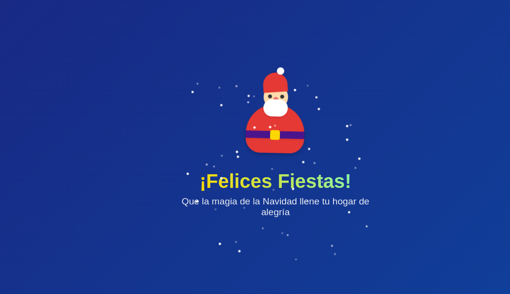

# Santa Claus Animation 🎅

A delightful, interactive web animation featuring Santa Claus in Google's minimalist design style. This project demonstrates modern CSS animations and JavaScript interactions to create a festive atmosphere.



 

## Features ✨

- Responsive, pure CSS Santa Claus character
- Smooth floating animation
- Dynamic falling gifts
- Twinkling star background
- Gradient text effects
- Google-inspired design language
- Cross-browser compatibility
- No external dependencies (except Google Fonts)

## Getting Started 🚀

### Prerequisites

- A modern web browser
- Basic understanding of HTML, CSS, and JavaScript

### Installation

1. Clone the repository:
```bash
git clone https://github.com/yourusername/santa-animation.git
```

2. Navigate to the project directory:
```bash
cd santa-animation
```

3. Open `index.html` in your preferred browser.

## Technical Details 🛠️

### Components

- **Santa Character**: Built entirely with CSS shapes and transforms
- **Animations**: Utilizes CSS keyframes for smooth movements
- **Dynamic Elements**: JavaScript-generated stars and falling gifts
- **Typography**: Google's Product Sans font family

### Browser Support

- Chrome (latest)
- Firefox (latest)
- Safari (latest)
- Edge (latest)

## Customization 🎨

### Colors

The animation uses Material Design colors. Main colors can be modified in the CSS:

```css
:root {
  --primary-red: #e53935;
  --primary-blue: #1a237e;
  --accent-gold: #ffd700;
}
```

### Animation Timing

Adjust animation speeds by modifying the keyframe durations:

```css
.santa {
  animation: float 3s ease-in-out infinite;
}
```

## Contributing 🤝

1. Fork the repository
2. Create your feature branch (`git checkout -b feature/AmazingFeature`)
3. Commit your changes (`git commit -m 'Add some AmazingFeature'`)
4. Push to the branch (`git push origin feature/AmazingFeature`)
5. Open a Pull Request

## Project Status 🚦

This project is actively maintained. Feel free to report issues or submit feature requests.

---

Made with ❤️ by [AugustoDevelop]

